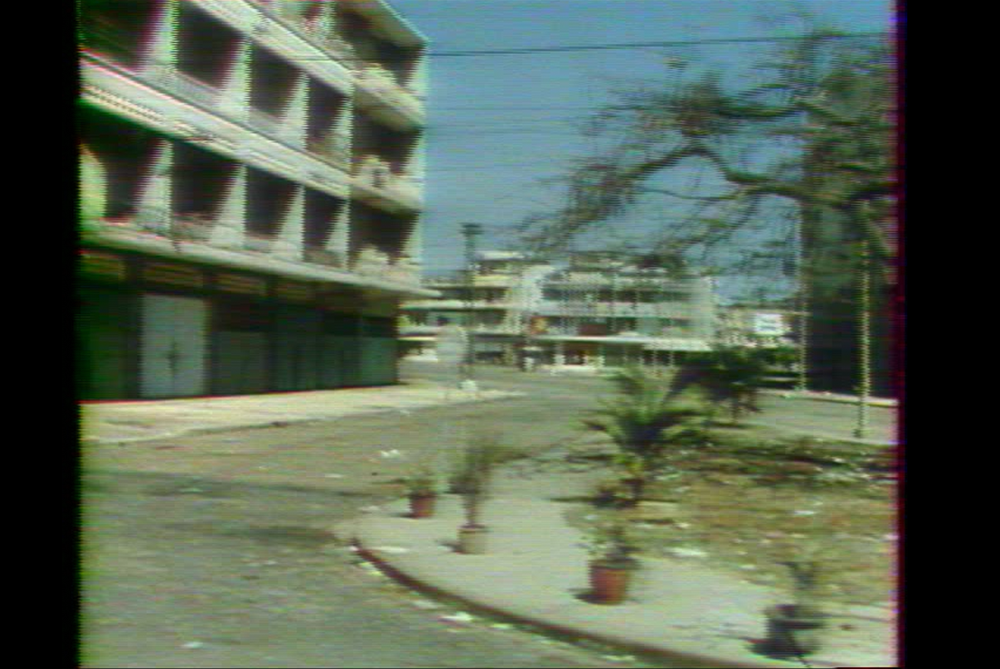
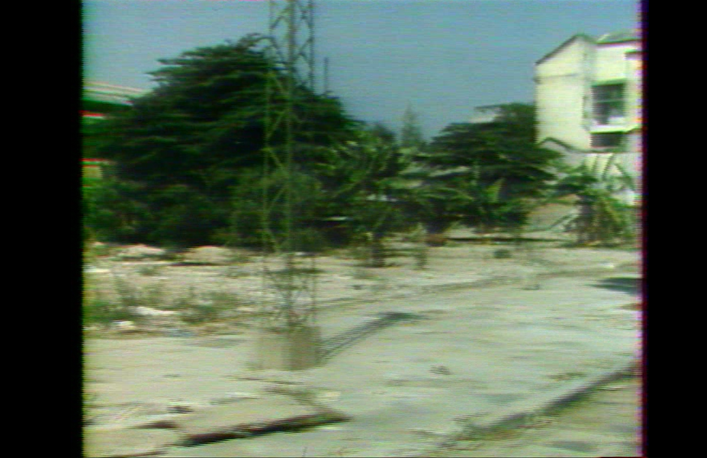
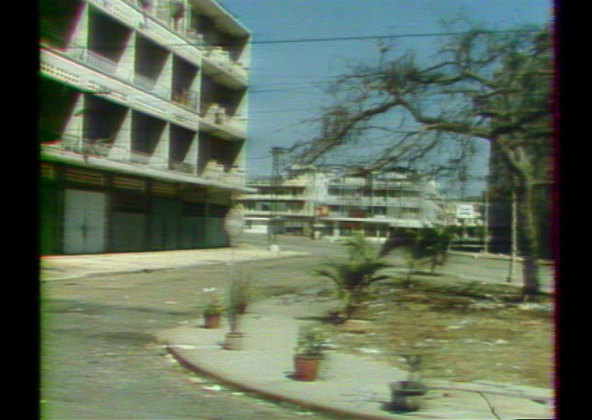
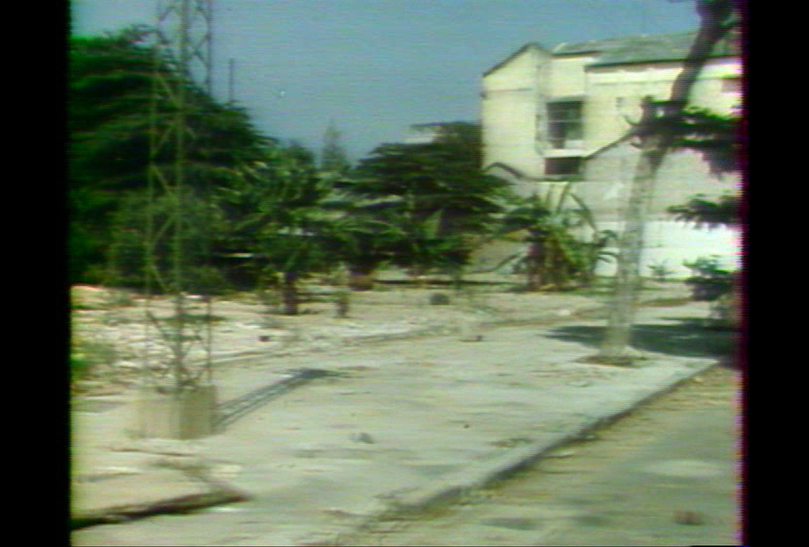

# Temporal and Spatial Dejittering for Interlaced Video of Original Film

## Overview

This Python code is designed to address a very specific video degradation issue of a film converted in an interlaced video: **non-constant temporal and spatial misalignments and mixing of lines (fields)**.

The code attempts to correct these artifacts by analyzing and adjusting each frame based on its relationship with the preceding frame. It learns and applies both **horizontal shifts** (to correct line misalignments) and **temporal blending** (to mitigate the mixing of fields from different time instances) on a **per-row basis**, at a **subpixel level**. This per-row granularity is crucial because the errors are not uniform across the frame.

## The Problem: Jitter and Field Mixing in Analog Video

Old analog video signals stored on magnetic tape are often recorded and played back using an **interlaced scanning** technique. In interlacing, each full video frame is displayed in two separate passes containing the odd-numbered horizontal lines of the image and the even-numbered horizontal lines of the image. These two fields are displayed sequentially at a high rate to create the illusion of a full frame. However, several issues can arise during recording, playback, or digitization, leading to artifacts.

## Code Functionality

**Per-Row Optimization:** The code processes the video frame by frame. For each row of the current frame, the code learns:
* **Horizontal Shift:** An optimal noninteger horizontal displacement to correct line misalignments with pixel interpolation.
* **Temporal Alpha:** A blending factor (between 0 and 1) to interpolate between the current frame's row and the corresponding row from the previous frame.
**Total Variation Minimization:** The optimization process aims to minimize the total variation in the output frame. The total variation is the sum of absolute values of the difference between each consecutive two lines.

## Example Visualizations

Below are example frames from the problematic video that inspired this work :

**1. Original Frame (Good upper part, bad lower part):**


**2. Same Frame (Odd lines from previous frame - Bad upper part, good lower part):**



As you can see, in this frame, the upper portion appears relatively stable in the original, while the lower part shows signs of field misalignment. When we simulate having the odd lines from the previous frame, the lower part improves but the upper part deteriorates, suggesting a temporal mixing issue that varies spatially.

**3. Original Frame (Bad upper part, good lower part):**


**4. Same Frame (Odd lines from previous frame - Good upper part, bad lower part):**




In this different frame, the lower part of the original is better, while the upper part exhibits artifacts. This time, simulating the odd lines being from the previous frame improves the upper section, highlighting the non-constant spatial and temporal nature of the problem.

## Generalization to Other Misaligned Videos

This code can be generalized to other videos suffering from global misalignments, in the case where the original source of the video was made of complete frames that were mis-aligned at some point. The idea might be adapted to other troubles.

## Usage

You can create a new python environment on conda, and install requirements by running

```
conda env create -n restaurate_jitter python=3.10
pip install -r requirements.txt
```

These requirements install torch with cuda version 12.4. You can then run the main script, providing the path to your input video and specifying the desired output path and processing parameters.

```bash
python main_restorate_lines.py --inputvideo input/input.mp4 --outputvideo output/output.mp4 --nbFrames '[number of frames to process, default : infinity]' --startTime '[start timecode in format hh:mm:ss]'
```

You can also change the optimization parameters --learning_rate (set to 0.1), --num_iteration (set to 100), --max_shift (maximum value authorized for pixel shift set to 5) 

## Results


