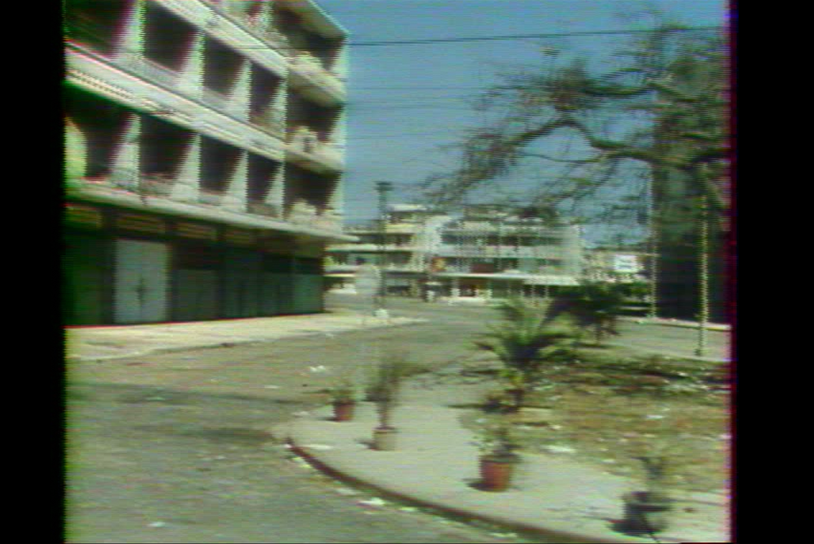
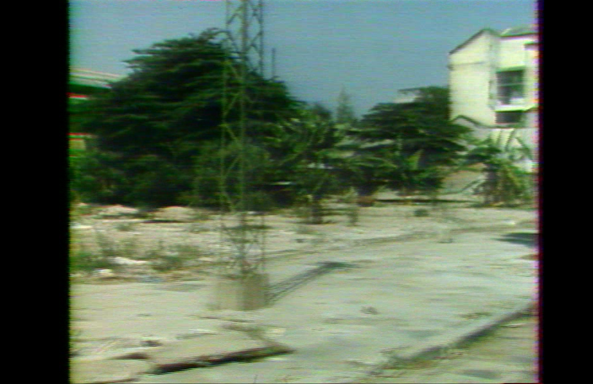

# Temporal and Spatial Dejittering for Interlaced Video

## Overview

This Python code is designed to address a very specific and complex video degradation issue: **non-constant temporal and spatial misalignments and mixing of lines (fields)**. This problem is particularly prevalent in older analog video formats, especially those originally recorded on magnetic tape and subsequently digitized.

The code attempts to correct these artifacts by analyzing and adjusting each frame based on its relationship with the preceding frame. It learns and applies both **horizontal shifts** (to correct line misalignments) and **temporal blending** (to mitigate the mixing of fields from different time instances) on a **per-row basis**. This per-row granularity is crucial because the errors are not uniform across the frame.

## The Problem: Jitter and Field Mixing in Analog Video

Old analog video signals, especially those stored on magnetic tape, are often recorded and played back using an **interlaced scanning** technique. In interlacing, each full video frame is displayed in two separate passes (fields):

* **Field 1 (Odd lines):** Contains all the odd-numbered horizontal lines of the image.
* **Field 2 (Even lines):** Contains all the even-numbered horizontal lines of the image.

These two fields are displayed sequentially at a high rate to create the illusion of a full frame. However, several issues can arise during recording, playback, or digitization, leading to the artifacts this code aims to correct:

* **Mechanical Instability:** Fluctuations in the speed of the tape transport or the rotation of the recording/playback heads can cause horizontal jitter and misalignments between the odd and even fields.
* **Magnetic Reading Errors:** Degradation of the magnetic tape or inconsistencies in the reading process can introduce timing errors, leading to the odd and even fields being misaligned or even partially corrupted.
* **Field Order Issues:** During digitization, the order of the fields might be reversed or inconsistent, leading to jerky motion and visual artifacts.
* **Temporal Mixing:** A particularly challenging issue occurs when the odd lines of a frame originate from one temporal field (e.g., the current one), while the even lines originate from a slightly different temporal field (e.g., the previous or next). This mixing can be inconsistent both across the frame (some parts are fine, others are mixed) and across time (the degree and direction of mixing changes from frame to frame). This is often visible as a "tearing" or "combing" effect, especially during motion.

## Code Functionality

This code tackles these issues by:

1.  **Loading Video Frames:** It reads the input video frame by frame.
2.  **Temporal Stacking:** For each current frame, it considers the immediately preceding frame.
3.  **Per-Row Optimization:** For each row of the current frame, the code learns:
    * **Horizontal Shift:** An optimal horizontal displacement to correct line misalignments.
    * **Temporal Alpha:** A blending factor (between 0 and 1) to interpolate between the current frame's row and the corresponding row from the previous frame. This addresses the temporal mixing of fields. The alpha value is learned independently for each row, allowing for spatially varying temporal correction.
4.  **Total Variation Minimization:** The optimization process aims to minimize the total variation in the output frame. This acts as a smoothness constraint, encouraging visually plausible corrections.
5.  **Frame-by-Frame Processing:** The code processes the video frame by frame, applying the learned corrections sequentially.

## Example Visualizations

Below are example frames from a problematic video, illustrating the issues this code aims to resolve:

**1. Original Frame (Upper part relatively good):**


**2. Same Frame (Odd lines from previous frame - Lower part relatively good):**



As you can see, in this frame, the upper portion appears relatively stable in the original, while the lower part shows signs of field misalignment. When we simulate having the odd lines from the previous frame, the lower part improves, suggesting a temporal mixing issue that varies spatially.

**3. Original Frame (Lower part relatively good):**


**4. Same Frame (Odd lines from previous frame - Upper part relatively good):**




In this different frame, the lower part of the original is better, while the upper part exhibits artifacts. Again, simulating the odd lines being from the previous frame improves the upper section, highlighting the non-constant spatial and temporal nature of the problem.

## Generalization to Other Misaligned Videos

While initially developed for a specific case, the underlying principles of this code can be generalized to other videos suffering from similar misalignments:

* **Horizontal Jitter:** The per-row horizontal shift correction can address various forms of line instability.
* **Interlacing Artifacts:** The temporal blending, even when only considering the previous frame, can help reduce "combing" artifacts arising from misaligned or temporally offset fields.
* **Digitization Issues:** If the digitization process introduced inconsistent field timing, the adaptive per-row adjustments might be able to compensate to some extent.

However, the effectiveness of the code on other videos will depend on the specific nature and severity of the misalignments. Fine-tuning the optimization parameters (learning rate, number of iterations) might be necessary for different types of video degradation.

## Usage

To use this code, you will need to have the required Python libraries installed (PyTorch, OpenCV, etc.). You can then run the main script, providing the path to your input video and specifying the desired output path and processing parameters.

```bash
python main_restorate_lines.py --inputvideo input.mp4 --outputvideo output.mp4 --nbFrames '[number of frames to process, default : infinity]' --startTime '[start timecode in format hh:mm:ss]'